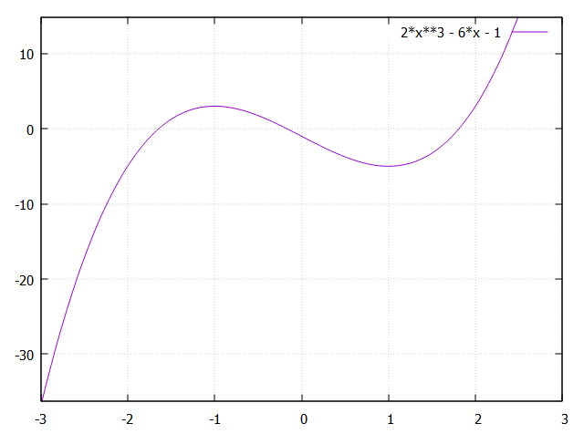
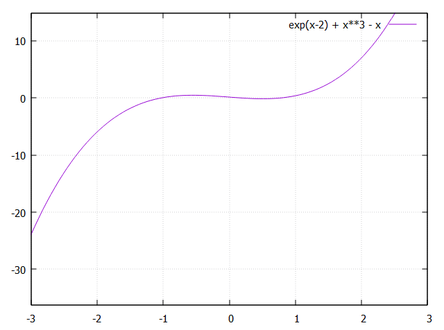
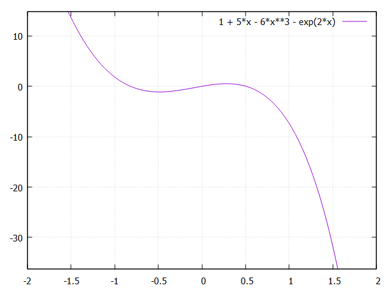

# Задача 1
1) x^3 = 9, x = 2.080082893371582
2) 3x^3 + x^2 = x+5, x = 1.1697263717651367
3) cos^2(x) + 6 = x , x = 6.776091575622559

# Задача 2
1) 2x^3−6𝑥−1=0
- x = -1.6417837142944336
- x = -0.16825389862060547
- x = 1.8100385665893555

2) e^(x - 2) + x^3 - x = 0
- x = -1.6417837142944336
- x = -0.16825389862060547
- x = 1.8100385665893555

3) 1 + 5x - 6x^3 - e^2x = 0
- x = -1.6417837142944336
- x = -0.16825389862060547
- x = 1.8100385665893555

# Задача 3
1) f(x) = x^3 - 2
- x = 1.2599210515618324
2) f(x) = x^3 - 3
- x = 1.4422495737671852
3) f(x) = x^3 - 5
- x = 1.7099759504199028

# Задача 4
Ответ: при h = 0.6357421875; 2.885498046875
